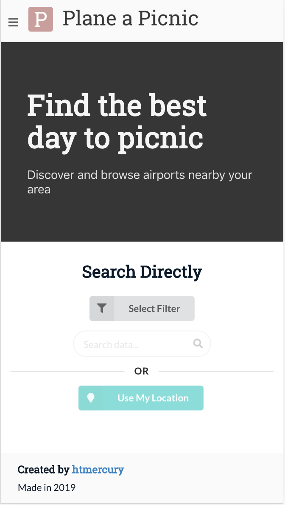

# Plane a Picnic
> Web app that predicts the direction of airplane traffic based on the weather report to help homeowners near an airport plan the best days to picnic outside and throw awesome parties in their back yards.

[![NPM Version][npm-image]][npm-url]

Plane-a-picnic utilizes the open sourced data available on OurAirports to reference runways located worldwide given an airport. A user is able to select an airport and given an airport, the app retrieves a five day forecast for where the airport is located. Using the forecast information, primarily the opposing wind angle, the app predicts and returns the most expected runway to be used each day. With the predicted runway, the user is able to plan on those days better picnic spots.



## Getting Started

These instructions will get you a copy of the project up and running on your local machine for development and testing purposes. See deployment for notes on how to deploy the project on a live system.

### Prerequisites

What things you need to start the web app

```
npm >= 6.50
aurelia-cli >= 1.0.0
PowerShell Core >= 6.0
.Net Core == 2.1
Azure SQL Database Instance
OpenWeatherMapAPI Key
```

### Set up

A step by step series of examples that tell you how to get a development env running


Clone the respository to your local environment

```
git clone https://github.com/htmercury/plane-a-picnic.git
```

Navigate into the project directory.

```
cd plane-a-picnic/plane-a-picnic
```
Set up your credentials by creating appsettings.json
```
cat appsettings.json
```
Format the appsettings.json similar to:
```
{
  "Logging": {
    "LogLevel": {
      "Default": "Warning"
    }
  },
  "AllowedHosts": "*",
  "ConnectionStrings": {
    "DefaultConnection": "{CONNECTION_STRING}"
  },
  "User": "{DB_USER}",
  "Password": "{DB_PASS}",
  "Server": "{SERVER_URL}",
  "OpenWeather": {
    "Key": "{API_KEY}"
  }
}
```
Add initial migrations and update database. (Make sure the DB firewall accepts your IP)
```
dotnet ef migrations add init
dotnet ef database update
```
Start powershell core.
```
pwsh
```
Import the open source data into your Azure SQL Database.
```
./importData.ps
```
Exit powershell core.
```
exit
```
Navigate to the aurelia project. (frontend)
```
cd ClientApp
```
Install the necessary dependencies.
```
npm install
```
Now, everything needed to run the project is installed.

## Running in development mode
At the project directory (/plane-a-picnic/plane-a-picnic), start up a local backend server.
```
dotnet run
OR
dotnet watchrun
```
In another shell window at (/plane-a-picnic/plane-a-picnic/ClientApp), start up a local frontend server.
```
au run
OR
au run --watch --hmr
```

## Running in production mode
Build and transpile the frontend at (/plane-a-picnic/plane-a-picnic/ClientApp).
```
au build
```
At the project directory (/plane-a-picnic/plane-a-picnic), start up a local backend server.
```
dotnet run
OR
dotnet watchrun
```

## Running the tests

At the base directory (/plane-a-picnic), execute
```
dotnet test
```

### Break down into end to end tests

The 15 tests all examine the components of AirportWeatherHandler.cs for expected behavior and accurate predictions based on toy data. The Nunit tests can be found in (/plane-a-picnic/plane-a-picnic.Nunit).

## Deployment

Add additional notes about how to deploy this on a live system. TBD

## Built With

* [Aurelia](https://aurelia.io/) - Frontend Framework
* [.NET Core 2.1](https://docs.microsoft.com/en-us/dotnet/core/whats-new/dotnet-core-2-1/) - Backend framework
* [Azure SQL Database](https://azure.microsoft.com/en-us/services/sql-database/) - DBMS

## Meta

Distributed under the MIT license. See ``LICENSE`` for more information.

[https://github.com/htmercury](https://github.com/htmercury/)

## Acknowledgments

* Hat tip to OurAirports for open sourced data on world-wide airports + runways
* Props to OpenWeatherMapAPI for accurate and up-to-date forecast information

## Contributing

1. Fork it (<https://github.com/htmercury/plane-a-picnic/fork>)
2. Create your feature branch (`git checkout -b feature/fooBar`)
3. Commit your changes (`git commit -am 'Add some fooBar'`)
4. Push to the branch (`git push origin feature/fooBar`)
5. Create a new Pull Request

<!-- Markdown link & img dfn's -->
[npm-image]: https://img.shields.io/npm/v/npm.svg
[npm-url]: https://npm.community/t/release-npm-6-9-0/5911
[wiki]: https://github.com/htmercury/plane-a-picnic/wiki
